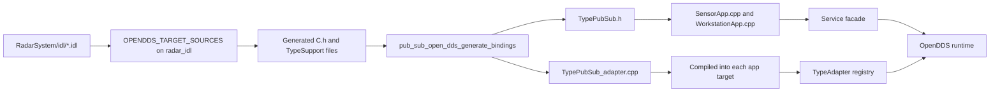

# RadarSystem: Using pub_sub_open_dds and Design Decisions

## Why This Document Exists
This guide is for teams working on SensorApp and WorkstationApp.
It explains:

1. How RadarSystem consumes pub_sub_open_dds
2. Why the architecture is set up this way
3. How IDL compile and generated adapters avoid direct OpenDDS usage in app code

## 1. App Integration Pattern

RadarSystem builds three logical targets:

1. radar_idl static library from IDL files
2. SensorApp executable
3. WorkstationApp executable

Both apps call the same helper:

- pub_sub_open_dds_generate_bindings(TARGET ... IDL_TARGET radar_idl TYPES ...)

This emits generated wrapper headers and adapter sources per IDL type.

## 2. Startup Model in RadarSystem

Both apps use config-driven startup:

1. sensor_service.ini
2. workstation_service.ini

The app flow is:

1. Load ServiceBootstrapConfig from file
2. Add optional runtime args from CLI
3. Call Service pre_activate with bootstrap config
4. Register subscriptions
5. post_activate
6. publish in loop

This keeps startup boilerplate low and makes runtime behavior easier to tune from config.

## 3. IDL Compile and Codegen Pipeline

## 4. Dependency Isolation Rationale

Goal:

- Keep app source files centered on domain logic and topic semantics

How isolation is achieved:

1. App source includes generated TypePubSub.h wrappers and facade headers
2. App source does not include OpenDDS TypeSupportImpl headers
3. Generated adapter .cpp files are the only per-type units that include TypeSupportImpl and perform typed narrow/write/read bridging

Result:

- Business code is less coupled to OpenDDS typed APIs
- Transport-specific complexity is pushed into generated glue and runtime internals

## 5. Why radar_idl Lives Next to IDL Files

The idl/CMakeLists placement keeps include behavior predictable for OpenDDS IDL tooling and avoids duplicate include-root hazards.
This was a deliberate decision to make generated include paths stable.

## 6. Why Both Apps List All Radar Types

Each app links bindings for all topic types so any publish or subscribe path can resolve adapters at runtime without missing registration failures.
This favors deterministic startup behavior over minimal per-binary type subsets.

## 7. Operational Notes

Runtime files copied near binaries include:

1. rtps.ini
2. sensor_topics.ini
3. workstation_topics.ini
4. sensor_service.ini
5. workstation_service.ini
6. radar_qos.xml

From build/RadarSystem, both apps can be started directly.

## 8. Team Discussion Prompts

1. Should each service keep one bootstrap file, or should environment-specific overlays be introduced
2. Should adapter generation remain per app target, or should shared generated binding libraries be added for larger deployments
3. Should service lifecycle ownership move to a process-level service registry layer in a future production branch
