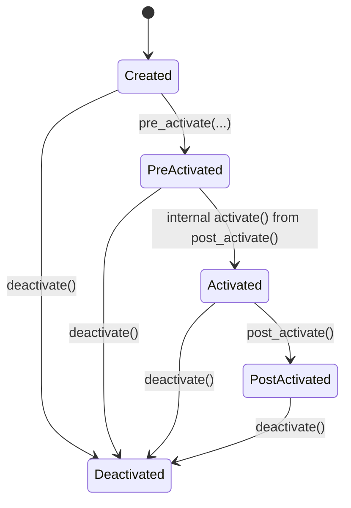
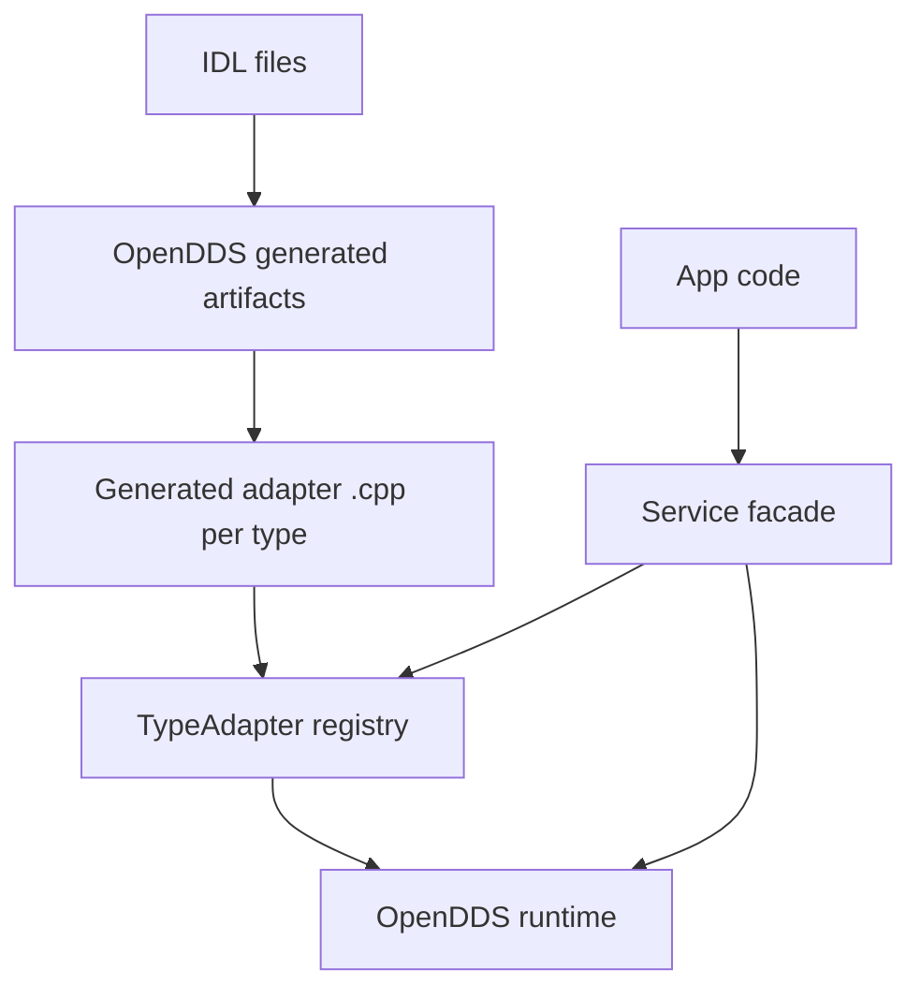

# SOLID_OpenDDS Detailed Design

## Scope
This document describes the concrete design of:

1. pub_sub_open_dds public API and internal seams
2. IDL compile and generated adapter flow
3. Runtime lifecycle, QoS mapping, and validation behavior
4. Test strategy and production-oriented extension points

## 1. Public API Surface

Installed public headers are intentionally small:

1. fwd.h
2. service_config.h
3. service_bootstrap_config.h
4. qos.h
5. topic_config.h
6. service.h

Public API concept:

- Service is the primary lifecycle and pub/sub facade
- ServiceConfig is the lower-level runtime input
- ServiceBootstrapConfig is the higher-level config-file startup input
- TopicConfig maps topic names to QoS profiles

## 2. Internal Structure

Internal files in pub_sub_open_dds/src include:

1. service.cpp
2. service_bootstrap_config.cpp
3. topic_config.cpp
4. qos_profile.cpp
5. registry.cpp
6. opendds_runtime.cpp
7. runtime.h
8. adapter support headers used by generated adapter .cpp files

Core separation:

- service.cpp owns lifecycle orchestration and type/topic consistency checks
- opendds_runtime.cpp owns OpenDDS participant, publisher, subscriber, and topic objects
- generated adapter .cpp units own per-type TypeSupport registration, typed writer/reader narrow, and write callback bridging

## 3. Lifecycle and State Machine

Service states:

1. Created
2. PreActivated
3. Activated
4. PostActivated
5. Deactivated

State transitions:

Important runtime behavior:

1. subscribe<T> after pre_activate is allowed
2. Subscriptions are staged until activation boundary
3. publish requires PostActivated
4. Topic-type mismatches are rejected on first conflict

## 4. Configuration Pipeline

### 4.1 ServiceBootstrapConfig

Purpose:

- Provide one-file startup contract for production apps

Fields:

1. domain_id
2. runtime_args
3. config_file
4. topic_config_file
5. qos_xml_file

Parsing behavior:

1. INI-like key = value lines
2. Comments with # or ;
3. Repeated runtime_arg entries append to a vector
4. Unknown keys fail fast with line-aware runtime_error
5. topic_config_file is required

### 4.2 TopicConfig

Purpose:

- Map topic names to built-in or XML-backed QoS profiles

Behavior:

1. Built-in profile resolution via qos.h catalog
2. XML profile resolution through OpenDDS XML loader when available
3. Fallback to default profile with warning when resolution fails

## 5. IDL Compile and Binding Design

### 5.1 IDL compile stage

CMake uses OPENDDS_TARGET_SOURCES on IDL library targets.
This generates mapping and TypeSupport artifacts from IDL files.

### 5.2 Facade codegen stage

pub_sub_open_dds_generate_bindings emits per-type files:

1. TypePubSub.h
2. TypePubSub_adapter.cpp

Wrapper header role:

- Exposes IDL type and facade include in one place

Adapter source role:

1. Includes TypeSupport implementation header
2. Implements detail::TypeAdapter
3. Registers adapter instance into process-wide adapter registry
4. Bridges erased facade calls to typed OpenDDS writer and reader calls

### 5.3 Why this removes app-level OpenDDS dependence

Application translation units can stay focused on:

1. Service API
2. Generated wrapper headers
3. Business logic

OpenDDS heavy typed plumbing is confined to generated adapter sources and runtime internals.

## 6. Registry and Type Resolution

There is a process-local type adapter registry keyed by C++ type_index.

At runtime:

1. Service publish/subscribe resolves adapter by type_index
2. Missing adapter yields a clear error referencing binding generation
3. First registration wins for duplicate static registration scenarios

## 7. Error and Validation Strategy

Current design favors explicit runtime errors over silent behavior:

1. Lifecycle misuse throws
2. Missing type adapter throws
3. Topic declaration mismatch throws
4. Topic/type conflict throws
5. Config parse issues throw with source context

## 8. Test Strategy

Current test classes include:

1. OpenDDS smoke integration test
2. Lifecycle tests with GMock runtime double
3. Bootstrap parser tests
4. QoS profile value tests
5. Topic config parser tests
6. XML QoS resolution regression test

This split keeps core logic testable without requiring transport for every case.

## 9. Production Adaptation Guidance

For a service registry style production system:

1. Treat ServiceBootstrapConfig as the external contract
2. Layer a registry that loads N bootstrap files and instantiates N Service objects
3. Keep topic binding ownership at service boundary, not in global static code
4. Preserve low-level pre_activate overloads for specialized service startup scenarios

## 10. Known Constraints

1. C++11 target baseline
2. XML QoS support depends on OpenDDS XML handler target availability
3. Generated adapters must be linked into each consuming target
4. Profile naming constraints for DDS XML schemas still apply
