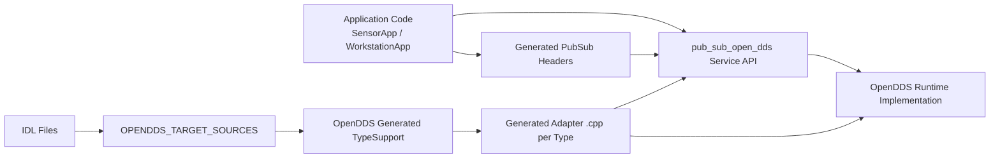
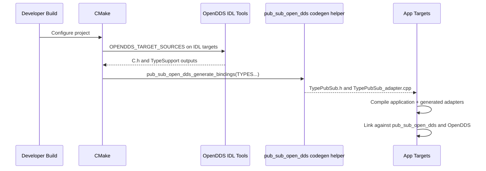

# SOLID_OpenDDS High-Level Design

## Audience and Purpose
This document is for engineering discussions, planning, and cross-team alignment.
It summarizes what the system does, why it is structured this way, and where the key boundaries are.

## System Summary
SOLID_OpenDDS has three main parts:

1. A reusable facade library: pub_sub_open_dds
2. A demo application pair: RadarSystem SensorApp and WorkstationApp
3. Test suites for behavior, parser logic, and OpenDDS integration

The facade is designed so application code mostly interacts with plain C++ types and a service-centric API, while OpenDDS-specific type support is concentrated in generated adapter translation units.

## Architectural Goals

1. Keep application code free of direct OpenDDS API usage where practical
2. Keep API usage simple for production teams through config-driven startup
3. Preserve an explicit low-level path for advanced users
4. Keep IDL-to-runtime binding deterministic and testable

## Component View

## Runtime Model

The Service API is lifecycle-based:

1. pre_activate(...)
2. subscribe<T>(...)
3. post_activate()
4. publish(...)
5. deactivate()

A new bootstrap config path simplifies startup for production:

- ServiceBootstrapConfig loaded from one file
- Service pre_activate overload that wires ServiceConfig and TopicConfig internally

## Configuration Model

There are two configuration layers:

1. Service bootstrap layer
- Domain id
- Runtime args
- Optional OpenDDS config file reference
- Topic config file path
- Optional XML QoS file path

2. Topic QoS mapping layer
- INI topic to profile mapping
- Built-in profile names or xml:ProfileName references

## IDL and Dependency Isolation Strategy

Key design decision:

- Application code includes generated type C headers via generated wrapper headers
- OpenDDS TypeSupport implementation headers are only pulled into generated adapter .cpp files

Why this matters:

1. Reduces OpenDDS surface area in app translation units
2. Centralizes transport-specific narrowing and write/read logic
3. Keeps type adapter registration explicit and deterministic

## Build and Codegen Flow

## Why Team Should Keep This Shape

1. It scales better as message count grows
2. It supports production startup through config files
3. It keeps transport details in fewer files
4. It gives clear boundaries for ownership:
- Library team owns facade and runtime internals
- Feature teams own app behavior and topic definitions

## Current Limits and Next Steps

Current:

1. OpenDDS runtime is the production runtime
2. TopicConfig still models QoS mapping at topic level
3. Adapter registration is per linked generated adapter unit

Potential next steps:

1. Add service registry layer on top of ServiceBootstrapConfig
2. Add schema validation and stricter bootstrap diagnostics
3. Add deployment profile examples for multiple service instances
